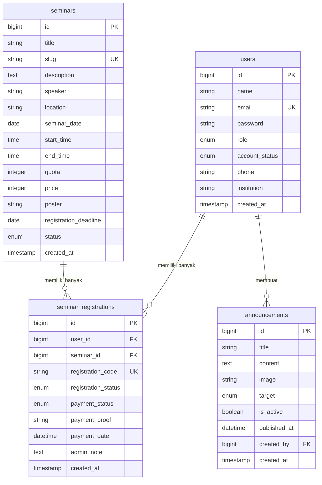

# Sistem Pendaftaran Seminar - Skema Pengembang Web LSP

Sistem Pendaftaran Seminar adalah aplikasi web full-stack yang dikembangkan khusus untuk memenuhi persyaratan uji kompetensi sertifikasi **LSP (Lembaga Sertifikasi Profesi)** dengan skema **Pengembang Web (Web Developer)**. 

Aplikasi ini mengelola alur pendaftaran seminar bagi Peserta dan manajemen kegiatan seminar serta verifikasi pembayaran/akun oleh Administrator.

---

## 🚀 Fitur Utama

### A. Fitur Administrator (Admin)
1. **Dashboard Statistik**: Ringkasan data peserta, seminar aktif, pendaftaran terbaru, dan grafik tren pendaftaran 10 hari terakhir menggunakan Chart.js.
2. **Verifikasi Akun Peserta**: Fitur menyetujui (`approved`) atau menolak (`rejected`) akun peserta yang baru mendaftar menggunakan teknologi **AJAX (Fetch API)** dan SweetAlert2 tanpa reload halaman.
3. **CRUD Manajemen Seminar**: Membuat, membaca, memperbarui, dan menghapus data seminar secara dinamis. Dilengkapi dengan fitur unggah poster kegiatan, pembatasan kuota, dan status kegiatan (`draft`, `published`, `closed`, `completed`).
4. **Verifikasi Pendaftaran & Pembayaran**: Memeriksa bukti transfer pembayaran (gambar/PDF) dalam modal browser, menyetujui, atau menolak pembayaran disertai catatan admin (`admin_note`) secara **AJAX**.
5. **CRUD Pengumuman**: Menyebarkan informasi kepada pengguna berdasarkan target audiens tertentu (`all`, `participants`, `admins`).

### B. Fitur Peserta (Participant)
1. **Registrasi Akun**: Melakukan pendaftaran akun mandiri dengan status awal `pending`.
2. **Otentikasi Aman**: Login dan logout menggunakan hashing password (`bcrypt`) dengan proteksi jika akun berstatus `pending` atau `rejected`.
3. **Dashboard Peserta**: Menyambut nama peserta, memantau status keaktifan akun, melihat pengumuman terbaru, serta ringkasan seminar yang diikuti.
4. **Pendaftaran Seminar**: Mendaftar seminar yang berstatus `published` sebelum tenggat waktu pendaftaran (`registration_deadline`) dan selama kuota masih tersedia. Dilengkapi proteksi pendaftaran ganda.
5. **Konfirmasi & Upload Pembayaran**: Mengunggah file bukti pembayaran berupa gambar (JPG, JPEG, PNG) atau dokumen PDF dengan batas ukuran 2MB. Peserta juga dapat melakukan unggah ulang bukti pembayaran jika ditolak oleh administrator.

---

## 🛠️ Teknologi yang Digunakan

* **Backend / Core**: PHP 8.2.x & Laravel 11.x
* **Database**: MySQL / MariaDB (via XAMPP)
* **Frontend**: HTML5, Vanilla JavaScript, CSS3
* **CSS Framework**: Bootstrap 5.3.x (via CDN)
* **Library Tambahan**: 
  * SweetAlert2 (Notifikasi & Dialog Konfirmasi Dinamis)
  * Bootstrap Icons (Koleksi Ikon UI)
  * Chart.js (Grafik Tren Dashboard)

---

## 📋 Persyaratan Sistem

* PHP >= 8.2
* Composer >= 2.x
* MySQL / MariaDB Server (XAMPP terinstal)
* Koneksi Internet (untuk CDN Bootstrap & SweetAlert2)

---

## 🔧 Panduan Instalasi dan Konfigurasi

Ikuti langkah-langkah di bawah ini untuk menjalankan aplikasi di lingkungan lokal Anda menggunakan **VS Code** dan **XAMPP**:

### Langkah 1: Kloning atau Salin Project
Pastikan folder project diletakkan di direktori kerja Anda (misalnya di folder `D:\📔\LSP\Program` atau direktori web server Anda).

### Langkah 2: Konfigurasi Database di XAMPP
1. Buka **XAMPP Control Panel** dan aktifkan modul **Apache** dan **MySQL**.
2. Buka browser dan akses **phpMyAdmin** (`http://localhost/phpmyadmin/`).
3. Buat database baru bernama `db_pendaftaran_seminar`.

### Langkah 3: Mengatur File `.env`
Salin file konfigurasi `.env.example` menjadi `.env` lalu sesuaikan konfigurasi database berikut:
```env
DB_CONNECTION=mysql
DB_HOST=127.0.0.1
DB_PORT=3306
DB_DATABASE=db_pendaftaran_seminar
DB_USERNAME=root
DB_PASSWORD=
```

### Langkah 4: Install Dependensi & Generate App Key
Jalankan perintah berikut pada Terminal VS Code:
```bash
composer install
php artisan key:generate
```

### Langkah 5: Jalankan Migration dan Seeder
Buat seluruh struktur tabel database beserta data contoh untuk demo LSP dengan menjalankan perintah:
```bash
php artisan migrate:fresh --seed
```

### Langkah 6: Membuat Symbolic Link Storage
Agar poster seminar dan bukti pembayaran yang diunggah dapat diakses dari browser, hubungkan folder storage dengan publik:
```bash
php artisan storage:link
```

### Langkah 7: Menjalankan Aplikasi
Mulai server lokal Laravel menggunakan perintah artisan:
```bash
php artisan serve
```
Buka browser Anda dan akses aplikasi melalui alamat: **`http://127.0.0.1:8000`**

---

## 🔑 Akun Demo Pengujian (Seeder)

Gunakan akun berikut untuk melakukan simulasi pengujian aplikasi:

### 1. Akun Administrator (Admin)
* **Email**: `admin@gmail.com`
* **Password**: `password`
* **Role**: `admin`
* **Status**: `approved` (otomatis aktif)

### 2. Akun Peserta Aktif (Approved Participant)
* **Email**: `peserta@gmail.com`
* **Password**: `password`
* **Role**: `participant`
* **Status**: `approved`

### 3. Akun Peserta Pending (Pending Participant)
* **Email**: `pending@gmail.com`
* **Password**: `password`
* **Role**: `participant`
* **Status**: `pending` (tidak bisa login sebelum disetujui admin)

### 4. Akun Peserta Ditolak (Rejected Participant)
* **Email**: `rejected@gmail.com`
* **Password**: `password`
* **Role**: `participant`
* **Status**: `rejected` (gagal login dan mendapatkan pemberitahuan)

---

## 🗄️ Struktur Database Ringkasan



---

## 💻 Cara Push ke GitHub

Jika Anda ingin menyimpan kode program ini ke repositori GitHub pribadi Anda untuk ditunjukkan kepada asesor:

1. Buka Git Bash atau Terminal VS Code di folder project.
2. Lakukan inisialisasi repositori lokal (jika belum):
   ```bash
   git init
   ```
3. Tambahkan semua file kecuali yang ada di `.gitignore`:
   ```bash
   git add .
   ```
4. Commit perubahan:
   ```bash
   git commit -m "Initial Commit: Sistem Pendaftaran Seminar LSP"
   ```
5. Buat repositori baru di akun GitHub Anda, lalu jalankan:
   ```bash
   git branch -M main
   git remote add origin https://github.com/USERNAME-ANDA/REPOS-ANDA.git
   git push -u origin main
   ```
*(Catatan: `.env` dan folder `vendor` secara otomatis diabaikan oleh `.gitignore` dan tidak akan terunggah demi keamanan).*
