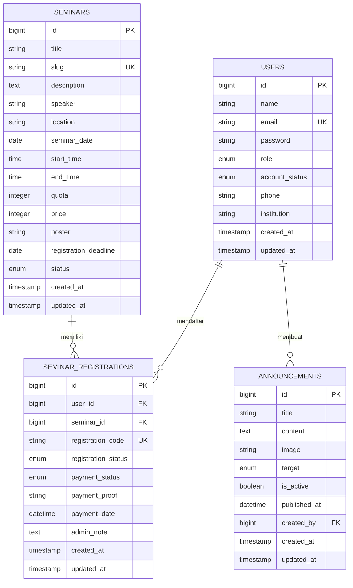

# Sistem Pendaftaran Seminar UMDP

Aplikasi web **Sistem Pendaftaran Seminar UMDP** merupakan aplikasi full-stack berbasis Laravel yang digunakan untuk mengelola pendaftaran akun peserta, kegiatan seminar, konfirmasi pembayaran, verifikasi pendaftaran, dan pengumuman.

Proyek ini dikembangkan untuk memenuhi tugas uji kompetensi **LSP UMDP – Skema Pengembang Web (Web Developer)**. Sistem memiliki dua jenis pengguna, yaitu **Administrator** dan **Peserta**.

## Daftar Isi

- [Fitur Utama](#fitur-utama)
- [Alur Sistem](#alur-sistem)
- [Spesifikasi Teknis](#spesifikasi-teknis)
- [Dependensi](#dependensi)
- [Persyaratan Sistem](#persyaratan-sistem)
- [Instalasi](#instalasi)
- [Akun Demo](#akun-demo)
- [Struktur Database](#struktur-database)
- [Struktur Direktori](#struktur-direktori)
- [Daftar Route Utama](#daftar-route-utama)
- [Validasi dan Ketentuan Upload](#validasi-dan-ketentuan-upload)
- [Keamanan Aplikasi](#keamanan-aplikasi)
- [Pengujian dan UAT](#pengujian-dan-uat)
- [Troubleshooting](#troubleshooting)
- [Deployment](#deployment)
- [Version Control GitHub](#version-control-github)
- [Batasan Sistem](#batasan-sistem)
- [Pengembang](#pengembang)

## Fitur Utama

### Fitur publik

- Menampilkan halaman utama Sistem Pendaftaran Seminar UMDP.
- Menampilkan daftar seminar berstatus `published`.
- Menampilkan detail seminar berdasarkan slug.
- Menampilkan informasi jadwal, pembicara, lokasi, harga, kuota, dan batas pendaftaran.
- Menyediakan halaman registrasi dan login.

### Fitur peserta

- Registrasi akun peserta.
- Status akun baru otomatis menjadi `pending`.
- Login hanya dapat dilakukan setelah akun berstatus `approved`.
- Melihat pengumuman yang ditujukan kepada peserta.
- Melihat seminar yang tersedia dan belum pernah didaftarkan.
- Mendaftar seminar selama status seminar aktif, batas waktu belum berakhir, dan kuota masih tersedia.
- Mendapatkan kode pendaftaran unik.
- Melihat status pendaftaran dan pembayaran.
- Mengunggah bukti pembayaran dalam format gambar atau PDF.
- Mengunggah ulang bukti pembayaran apabila pembayaran ditolak.
- Seminar gratis otomatis memiliki status pembayaran `paid`.

### Fitur administrator

- Login ke panel administrator.
- Melihat dashboard statistik peserta, seminar, pendaftaran, dan pembayaran.
- Melihat grafik pendaftaran selama 10 hari terakhir menggunakan Chart.js.
- Memverifikasi akun peserta dengan status diterima atau ditolak.
- Mengelola data seminar dengan operasi CRUD.
- Mengunggah dan mengganti poster seminar.
- Mengatur status seminar: `draft`, `published`, `closed`, atau `completed`.
- Melihat detail seminar beserta daftar peserta.
- Mencari dan memfilter data pendaftaran.
- Memverifikasi atau menolak pembayaran dan pendaftaran peserta.
- Memberikan catatan administrator ketika pembayaran ditolak.
- Mengelola pengumuman dengan operasi tambah, ubah, dan hapus.
- Menentukan target pengumuman untuk semua pengguna, peserta, atau administrator.
- Mengunggah gambar pengumuman.

## Alur Sistem

### Alur peserta

1. Peserta membuat akun melalui halaman registrasi.
2. Sistem menyimpan akun dengan status `pending`.
3. Administrator menerima atau menolak akun peserta.
4. Peserta dengan status `approved` dapat login.
5. Peserta memilih seminar yang masih tersedia.
6. Sistem memeriksa status seminar, batas pendaftaran, kuota, dan pendaftaran ganda.
7. Untuk seminar berbayar, peserta mengunggah bukti pembayaran.
8. Administrator memverifikasi pembayaran dan pendaftaran.
9. Peserta dapat melihat hasil verifikasi pada dashboard dan halaman detail pendaftaran.

### Alur administrator

1. Administrator login menggunakan akun admin.
2. Administrator memverifikasi akun peserta baru.
3. Administrator membuat dan mempublikasikan seminar.
4. Administrator memantau pendaftaran peserta.
5. Administrator memeriksa bukti pembayaran.
6. Administrator menyetujui atau menolak pendaftaran.
7. Administrator membuat pengumuman sesuai target pengguna.

## Spesifikasi Teknis

| Komponen | Spesifikasi |
|---|---|
| Jenis aplikasi | Aplikasi web full-stack |
| Arsitektur | MVC (Model–View–Controller) |
| Bahasa backend | PHP `^8.2` |
| Framework backend | Laravel `12.63.0` |
| Database | MySQL/MariaDB |
| Template engine | Laravel Blade |
| Framework CSS utama | Bootstrap `5.3.2` melalui CDN |
| Ikon | Bootstrap Icons `1.11.1` melalui CDN |
| Notifikasi | SweetAlert2 `11` melalui CDN |
| Grafik | Chart.js melalui CDN |
| JavaScript | Vanilla JavaScript dan Fetch API |
| Build tool | Vite `^7.0.7` |
| Version control | Git dan GitHub |
| Penyimpanan file | Laravel Storage disk `public` |
| Autentikasi | Session-based authentication Laravel |
| Otorisasi | Middleware berdasarkan role dan status akun |

### Aktor sistem

| Aktor | Hak akses utama |
|---|---|
| Peserta | Registrasi akun, login, melihat seminar, mendaftar seminar, mengunggah pembayaran, melihat status, dan membaca pengumuman |
| Administrator | Verifikasi akun, CRUD seminar, verifikasi pendaftaran dan pembayaran, CRUD pengumuman, serta melihat dashboard statistik |

### Status yang digunakan

| Entitas | Nilai status |
|---|---|
| Akun peserta | `pending`, `approved`, `rejected` |
| Seminar | `draft`, `published`, `closed`, `completed` |
| Pendaftaran | `pending`, `approved`, `rejected`, `cancelled` |
| Pembayaran | `unpaid`, `waiting_verification`, `paid`, `rejected` |

## Dependensi

### Dependensi Composer utama

| Package | Versi/Ketentuan | Kegunaan |
|---|---:|---|
| `php` | `^8.2` | Runtime aplikasi |
| `laravel/framework` | `^12.0` | Framework utama aplikasi |
| `laravel/tinker` | `^2.10.1` | Interaksi dengan aplikasi melalui terminal |

### Dependensi Composer pengembangan

| Package | Versi/Ketentuan | Kegunaan |
|---|---:|---|
| `fakerphp/faker` | `^1.23` | Pembuatan data contoh |
| `laravel/pail` | `^1.2.2` | Pemantauan log aplikasi |
| `laravel/pint` | `^1.24` | Penyeragaman format kode PHP |
| `laravel/sail` | `^1.41` | Lingkungan pengembangan Docker Laravel |
| `mockery/mockery` | `^1.6` | Mocking pada pengujian |
| `nunomaduro/collision` | `^8.6` | Tampilan error terminal |
| `phpunit/phpunit` | `^11.5.50` | Framework pengujian PHP |

### Dependensi Node.js

| Package | Versi/Ketentuan | Kegunaan |
|---|---:|---|
| `vite` | `^7.0.7` | Build tool aset frontend |
| `laravel-vite-plugin` | `^2.0.0` | Integrasi Laravel dengan Vite |
| `tailwindcss` | `^4.0.0` | Tersedia pada scaffolding frontend |
| `@tailwindcss/vite` | `^4.0.0` | Integrasi Tailwind dengan Vite |
| `axios` | `^1.11.0` | HTTP client frontend |
| `concurrently` | `^9.0.1` | Menjalankan beberapa proses pengembangan |

> Antarmuka aplikasi saat ini menggunakan Bootstrap, SweetAlert2, Bootstrap Icons, dan Chart.js melalui CDN. Instalasi Node.js hanya diperlukan apabila aset Vite akan dikembangkan atau dibangun ulang.

## Persyaratan Sistem

Pastikan perangkat memiliki perangkat lunak berikut:

- PHP 8.2 atau lebih baru.
- Composer 2.x.
- MySQL atau MariaDB.
- Web browser modern, seperti Google Chrome, Microsoft Edge, atau Mozilla Firefox.
- Git untuk melakukan clone dan version control.
- Node.js dan npm bersifat opsional untuk pengembangan aset Vite.
- Koneksi internet untuk memuat library frontend melalui CDN.

Ekstensi PHP yang perlu aktif:

- `ctype`
- `fileinfo`
- `filter`
- `hash`
- `mbstring`
- `openssl`
- `pdo_mysql`
- `session`
- `tokenizer`

Pada XAMPP, ekstensi dapat diperiksa melalui file `php.ini`.

## Instalasi

### 1. Clone repositori

```bash
git clone https://github.com/julianjie/LSP-Seminar.git
cd LSP-Seminar
```

Apabila proyek diperoleh dalam bentuk ZIP atau RAR, ekstrak arsip lalu buka terminal pada folder yang berisi file `artisan`.

### 2. Instal dependensi PHP

```bash
composer install
```

### 3. Buat file environment

Windows Command Prompt:

```bat
copy .env.example .env
```

Git Bash, Linux, atau macOS:

```bash
cp .env.example .env
```

### 4. Buat database

Aktifkan MySQL melalui XAMPP, Laragon, atau layanan database lain. Buat database baru melalui phpMyAdmin atau MySQL CLI:

```sql
CREATE DATABASE db_pendaftaran_seminar
CHARACTER SET utf8mb4
COLLATE utf8mb4_unicode_ci;
```

### 5. Konfigurasi `.env`

Ubah konfigurasi aplikasi dan database pada file `.env`:

```env
APP_NAME="Seminar UMDP"
APP_ENV=local
APP_KEY=
APP_DEBUG=true
APP_URL=http://127.0.0.1:8000

DB_CONNECTION=mysql
DB_HOST=127.0.0.1
DB_PORT=3306
DB_DATABASE=db_pendaftaran_seminar
DB_USERNAME=root
DB_PASSWORD=
```

Sesuaikan `DB_USERNAME` dan `DB_PASSWORD` dengan konfigurasi MySQL pada perangkat.

### 6. Generate application key

```bash
php artisan key:generate
```

### 7. Bersihkan cache konfigurasi

```bash
php artisan optimize:clear
```

### 8. Jalankan migration dan seeder

Untuk instalasi baru yang databasenya belum berisi data penting:

```bash
php artisan migrate:fresh --seed
```

Perintah `migrate:fresh` akan menghapus seluruh tabel sebelum membuatnya kembali. Untuk database yang telah memiliki data, gunakan:

```bash
php artisan migrate
php artisan db:seed
```

### 9. Buat symbolic link storage

```bash
php artisan storage:link
```

Perintah ini diperlukan agar poster seminar, gambar pengumuman, dan bukti pembayaran dapat diakses dari browser.

### 10. Instal dependensi frontend opsional

Langkah ini diperlukan apabila ingin menjalankan atau membangun aset Vite:

```bash
npm install
npm run build
```

Untuk mode pengembangan Vite:

```bash
npm run dev
```

### 11. Jalankan aplikasi

```bash
php artisan serve
```

Buka aplikasi melalui:

```text
http://127.0.0.1:8000
```

## Akun Demo

Data berikut dibuat oleh `DatabaseSeeder` setelah menjalankan perintah seeding.

| Jenis akun | Email | Password | Status |
|---|---|---|---|
| Administrator | `admin@gmail.com` | `password` | `approved` |
| Peserta aktif | `peserta@gmail.com` | `password` | `approved` |
| Peserta menunggu | `pending@gmail.com` | `password` | `pending` |
| Peserta ditolak | `rejected@gmail.com` | `password` | `rejected` |

> Akun demo hanya digunakan untuk pengujian lokal. Ganti password dan hapus data demo sebelum aplikasi digunakan pada lingkungan produksi.

## Struktur Database

Aplikasi memiliki empat tabel domain utama:

1. `users`
2. `seminars`
3. `seminar_registrations`
4. `announcements`

Laravel juga membuat tabel pendukung seperti `sessions`, `cache`, `jobs`, `failed_jobs`, dan `password_reset_tokens`.



### Relasi database

- Satu pengguna dapat memiliki banyak pendaftaran seminar.
- Satu seminar dapat memiliki banyak pendaftaran.
- Kombinasi `user_id` dan `seminar_id` dibuat unik untuk mencegah pendaftaran ganda.
- Satu administrator dapat membuat banyak pengumuman.
- Ketika pengguna dihapus, data pendaftarannya ikut dihapus melalui `ON DELETE CASCADE`.
- Ketika pembuat pengumuman dihapus, nilai `created_by` menjadi `NULL` melalui `ON DELETE SET NULL`.

## Struktur Direktori

```text
LSP-Seminar/
├── app/
│   ├── Http/
│   │   ├── Controllers/
│   │   │   ├── Admin/
│   │   │   └── Participant/
│   │   └── Middleware/
│   └── Models/
├── bootstrap/
├── config/
├── database/
│   ├── migrations/
│   └── seeders/
├── public/
│   └── css/
├── resources/
│   ├── css/
│   ├── js/
│   └── views/
│       ├── admin/
│       ├── auth/
│       ├── layouts/
│       └── participant/
├── routes/
│   └── web.php
├── storage/
│   └── app/public/
├── tests/
├── .env.example
├── artisan
├── composer.json
├── package.json
└── vite.config.js
```

## Daftar Route Utama

### Route publik dan autentikasi

| Method | URL | Fungsi |
|---|---|---|
| GET | `/` | Halaman utama |
| GET | `/seminars` | Daftar seminar publik |
| GET | `/seminars/{slug}` | Detail seminar |
| GET | `/register` | Form registrasi akun |
| POST | `/register` | Menyimpan akun peserta |
| GET | `/login` | Form login |
| POST | `/login` | Proses login |
| POST | `/logout` | Proses logout |

### Route peserta

Seluruh route peserta dilindungi middleware `auth`, `role:participant`, dan `approved`.

| Method | URL | Fungsi |
|---|---|---|
| GET | `/participant/dashboard` | Dashboard peserta |
| POST | `/participant/seminars/{seminar}/register` | Mendaftar seminar |
| GET | `/participant/registrations/{registration}` | Detail pendaftaran |
| POST | `/participant/registrations/{registration}/upload-payment` | Upload bukti pembayaran |

### Route administrator

Seluruh route administrator dilindungi middleware `auth` dan `role:admin`.

| Method | URL | Fungsi |
|---|---|---|
| GET | `/admin/dashboard` | Dashboard administrator |
| GET | `/admin/account-verification` | Daftar akun peserta |
| POST | `/admin/account-verification/{user}/status` | Verifikasi akun |
| Resource | `/admin/seminars` | CRUD seminar |
| GET | `/admin/registrations` | Daftar pendaftaran |
| POST | `/admin/registrations/{registration}/verify` | Verifikasi pembayaran |
| Resource | `/admin/announcements` | Pengelolaan pengumuman |

Daftar route lengkap dapat diperiksa dengan:

```bash
php artisan route:list
```

## Validasi dan Ketentuan Upload

| Jenis file | Format yang diterima | Ukuran maksimal | Lokasi penyimpanan |
|---|---|---:|---|
| Poster seminar | JPG, JPEG, PNG, WEBP | 2 MB | `storage/app/public/posters` |
| Gambar pengumuman | JPG, JPEG, PNG, WEBP | 2 MB | `storage/app/public/announcements` |
| Bukti pembayaran | JPG, JPEG, PNG, PDF | 2 MB | `storage/app/public/payments` |

Validasi tambahan:

- Email peserta harus unik.
- Password peserta minimal delapan karakter dan harus dikonfirmasi.
- Nomor telepon dan institusi wajib diisi saat registrasi.
- Slug seminar harus unik.
- Kuota seminar minimal satu peserta.
- Harga seminar tidak boleh bernilai negatif.
- Batas pendaftaran tidak boleh melewati tanggal seminar.
- Peserta tidak dapat mendaftar seminar yang sama lebih dari satu kali.
- Pembayaran yang ditolak wajib disertai catatan administrator.

## Keamanan Aplikasi

Implementasi keamanan yang digunakan:

- Password disimpan menggunakan hashing Laravel.
- Session diregenerasi setelah login berhasil.
- Session dihapus dan token diregenerasi saat logout.
- Form POST, PUT, PATCH, dan DELETE menggunakan proteksi CSRF Laravel.
- Middleware `RoleMiddleware` membatasi halaman berdasarkan role pengguna.
- Middleware `CheckAccountStatus` membatasi akses peserta yang belum disetujui atau ditolak.
- Route peserta dan administrator dilindungi middleware autentikasi.
- Pemilik pendaftaran diperiksa sebelum membuka detail atau mengunggah pembayaran.
- Input pengguna divalidasi pada sisi server.
- File upload dibatasi berdasarkan tipe MIME dan ukuran.
- Operasi penting menggunakan database transaction.
- Constraint unik database mencegah pendaftaran seminar ganda.
- File `.env` dan folder `vendor` telah dicantumkan pada `.gitignore`.

## Pengujian dan UAT

### Menjalankan automated test

```bash
php artisan test
```

Proyek menyediakan pengujian dasar pada folder `tests/Feature` dan `tests/Unit`. Pengujian tambahan dapat dibuat untuk setiap proses bisnis utama.

### Skenario User Acceptance Test

| No. | Skenario | Langkah ringkas | Hasil yang diharapkan |
|---:|---|---|---|
| 1 | Registrasi peserta | Isi form registrasi dengan data valid | Akun tersimpan dengan status `pending` |
| 2 | Login akun pending | Login menggunakan akun pending | Login ditolak dan muncul pemberitahuan verifikasi |
| 3 | Verifikasi akun | Admin menyetujui akun pending | Status berubah menjadi `approved` tanpa reload penuh |
| 4 | Login peserta aktif | Login menggunakan akun approved | Peserta masuk ke dashboard |
| 5 | CRUD seminar | Admin menambah, melihat, mengubah, dan menghapus seminar | Data seminar berubah sesuai tindakan |
| 6 | Pendaftaran seminar | Peserta mendaftar seminar aktif | Kode pendaftaran dibuat dan data tersimpan |
| 7 | Pendaftaran ganda | Peserta mendaftar seminar yang sama kembali | Sistem menolak pendaftaran |
| 8 | Deadline seminar | Peserta mendaftar setelah batas pendaftaran | Sistem menolak pendaftaran |
| 9 | Upload pembayaran | Peserta mengunggah file valid maksimal 2 MB | Status menjadi `waiting_verification` |
| 10 | File pembayaran tidak valid | Unggah file dengan format/ukuran tidak sesuai | Sistem menampilkan pesan validasi |
| 11 | Verifikasi pembayaran | Admin menyetujui bukti pembayaran | Pembayaran menjadi `paid` dan pendaftaran `approved` |
| 12 | Penolakan pembayaran | Admin menolak dengan catatan | Status menjadi `rejected` dan catatan tampil ke peserta |
| 13 | Seminar gratis | Peserta mendaftar seminar dengan harga nol | Pembayaran otomatis menjadi `paid` |
| 14 | Kuota penuh | Admin menyetujui pendaftaran saat kuota penuh | Sistem menolak persetujuan baru |
| 15 | Pengumuman peserta | Admin membuat pengumuman target peserta | Pengumuman tampil pada dashboard peserta |
| 16 | Otorisasi role | Peserta membuka URL admin | Akses ditolak atau dialihkan ke dashboard peserta |

## Troubleshooting

### Gambar atau bukti pembayaran tidak tampil

Jalankan:

```bash
php artisan storage:link
php artisan optimize:clear
```

Apabila symbolic link lama rusak pada Windows, hapus folder/link `public/storage`, lalu jalankan kembali `php artisan storage:link`.

### Error `SQLSTATE[HY000] [1049] Unknown database`

Pastikan database `db_pendaftaran_seminar` telah dibuat dan nilai `DB_DATABASE` pada `.env` sudah benar.

### Error `Access denied for user`

Periksa nilai berikut pada `.env`:

```env
DB_USERNAME=root
DB_PASSWORD=
```

Sesuaikan dengan akun MySQL yang digunakan, kemudian jalankan:

```bash
php artisan config:clear
```

### Error `Call to undefined function mb_split()`

Aktifkan ekstensi `mbstring` pada `php.ini`:

```ini
extension=mbstring
```

Setelah itu restart terminal, Apache, atau PHP server.

### Error `419 Page Expired`

- Pastikan form Blade memiliki directive `@csrf`.
- Pastikan aplikasi dibuka menggunakan URL yang sama dengan `APP_URL`.
- Bersihkan cache dan session:

```bash
php artisan optimize:clear
```

### Error class atau autoload tidak ditemukan

```bash
composer install
composer dump-autoload
php artisan optimize:clear
```

### Data seeder ganda atau konflik email

Untuk mengulang database pengujian dari awal:

```bash
php artisan migrate:fresh --seed
```

> Perintah tersebut menghapus seluruh data pada database yang digunakan.

## Deployment

Checklist deployment sederhana:

1. Upload source code ke server tanpa file `.env` lokal.
2. Buat `.env` khusus server.
3. Gunakan konfigurasi produksi:

```env
APP_ENV=production
APP_DEBUG=false
```

4. Instal dependensi produksi:

```bash
composer install --no-dev --optimize-autoloader
```

5. Generate key apabila belum tersedia:

```bash
php artisan key:generate
```

6. Jalankan migration:

```bash
php artisan migrate --force
```

7. Buat storage link:

```bash
php artisan storage:link
```

8. Optimalkan aplikasi:

```bash
php artisan optimize
```

9. Pastikan document root domain diarahkan ke folder `public`.
10. Pastikan folder `storage` dan `bootstrap/cache` dapat ditulis oleh web server.

## Version Control GitHub

Repositori proyek:

```text
https://github.com/julianjie/LSP-Seminar
```

Contoh alur commit dan push:

```bash
git status
git add .
git commit -m "docs: lengkapi dokumentasi README"
git branch -M main
git push origin main
```

Apabila remote belum ditambahkan:

```bash
git remote add origin https://github.com/julianjie/LSP-Seminar.git
git push -u origin main
```

File atau folder yang tidak boleh diunggah:

- `.env`
- `vendor/`
- `node_modules/`
- `storage/logs/`
- file kredensial atau password

## Batasan Sistem

- Verifikasi pembayaran dilakukan secara manual oleh administrator.
- Sistem belum terintegrasi dengan payment gateway.
- Sistem belum mengirim notifikasi melalui email, WhatsApp, atau push notification.
- Aplikasi memerlukan koneksi internet untuk memuat library frontend yang menggunakan CDN.
- Pengelolaan peserta berfokus pada status akun dan belum menyediakan fitur edit profil lanjutan.
- Sistem dikembangkan sesuai ruang lingkup proyek sertifikasi dan penggunaan lokal/demonstrasi.

## Pengembang

**Julian Jie**  
NPM: `2327250024`  
Program Studi Informatika  
Universitas Multi Data Palembang

Proyek ini dibuat sebagai bagian dari uji kompetensi **LSP UMDP – Pengembang Web (Web Developer)**.
